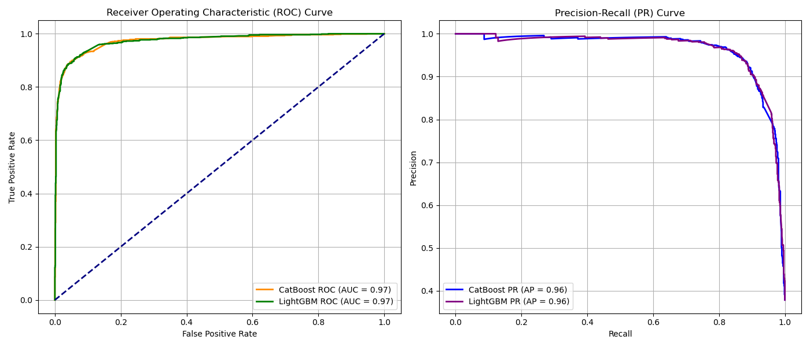

# Lead Scoring Application for Digital Products

## Dataset

The dataset for this project can be found on [Kaggle](https://www.kaggle.com/datasets/amritachatterjee09/lead-scoring-dataset).
The dataset contains detailed information about leads generated by an anonymous education company which sells online courses to professionals. 
The dataset contains the leads origin (e.g., Google, referrals, or landing pages), engagement metrics (e.g., total website visits, time spent, and page views), and customer preferences (e.g., communication preferences and course motivations). It also includes variables such as lead quality, customer demographics, past activities, and target outcomes (conversion status), making it suitable for building a lead scoring model.


## Objectives
An anonymous education company sell online courses to professionals. They want to go from the current low lead conversion rate of approximately 30%, to an overall lead conversion rate to 80%. A lead scoring model needs to be developed to indetify promising leads, which would then take priority in the sales team efforts. 

The main objective of this project is:

> **To develop a lead scoring system that will reliably predict conversion proclivity of exhisting leads**

To achieve this objective, it was further broken down into the following 4 technical sub-objectives:

1. To perform in-depth exploratory data analysis of the dataset
2. To perform feature engineering and feature selection, with a focus on the categorical variables
3. To develop a supervised model to classify behaviour into 'will convert' and 'will not convert'
4. To create an pipeline for pre-processing, traing and prediction

## Main Insights

From the exploratory data analysis, we found out that 'Converted' behaviour patterns are cahracterised by:

* Their current occupation. Housewives and working professionals convert at higher rate comparet to others such as students or unempolyed. Possibly because of more disposable income.
* Leads that interacted with a sales person (e.g. via chat option, phone call) have much higher rates of conversion
* Majority of information collected is not useful for lead conversion prediction

## Features Selection 

The dataset came with many multi-categorical features with low predictive power. Thorough feature selection including importance feature selection was performed. Columns dropped were ..... 
This achieved a  __ increas in ptocessing time and a __ decrease in space. 

As a result of this feature engineering work, the ROC AUC for the final model has increased by 30% and has improved F1 score uplift from the baseline model from 1.5 to 1.8.

## Model Selection

Models were compared between each other using ROC AUC since we're dealing with binary classification task and the label distribution is relatively balanced.
2 models (LightGBM and and CatBoost) were tuned for 50 iterations. 
The best performing model is CatBoost with the following parameters:
```json
{'classifier__random_strength': 1,
 'classifier__learning_rate': 0.5,
 'classifier__l2_leaf_reg': 7,
 'classifier__iterations': 10,
 'classifier__depth': 10,
 'classifier__border_count': 50,}
```

 


